# 🖼️ AI-Powered Image Enhancement Pipeline

## Medikabazaar E-Commerce Image Quality System

> **Hackathon Project**: Automated image quality assessment and enhancement pipeline for marketplace product images using AWS Bedrock AI models.

---

## 📋 Table of Contents

1. [Executive Summary](#executive-summary)
2. [System Architecture](#system-architecture)
3. [Pipeline Flow](#pipeline-flow)
4. [AI Model Strategy](#ai-model-strategy)
5. [Database Schema](#database-schema)
6. [Cost Optimization](#cost-optimization)
7. [API Endpoints](#api-endpoints)
8. [Technology Stack](#technology-stack)

---

## 🎯 Executive Summary

### Problem Statement
Medikabazaar's e-commerce marketplace contains **89,000+ product images** with inconsistent quality:
- Blurry or low-resolution images
- Poor lighting and exposure
- Cluttered backgrounds
- Inconsistent dimensions and formats

### Solution
An **AI-powered hybrid pipeline** that:
1. **Analyzes** image quality using industry-standard metrics (BRISQUE)
2. **Routes** processing to optimal AI models based on detected issues
3. **Enhances** images automatically with smart model selection
4. **Optimizes** output for web delivery
5. **Tracks** all operations with full audit trail

### Key Metrics
| Metric | Value |
|--------|-------|
| Processing Speed | 10-30 images/second (local) |
| AI Enhancement Cost | $0.02-0.04/image |
| Local Processing Cost | $0.00/image |
| Expected AI Usage | 10-20% of images |
| **Effective Cost** | **~$0.004/image** |

---

## 🏗️ System Architecture

### High-Level Architecture

```mermaid
flowchart TB
    subgraph CLIENT["👤 Client Layer"]
        UI[("🖥️ Streamlit Dashboard")]
        API[("🔌 REST API")]
    end

    subgraph STORAGE["☁️ AWS Storage"]
        S3_ORIG[("📦 S3: Original Images")]
        S3_ENH[("📦 S3: Enhanced Images")]
        CF[("🌐 CloudFront CDN")]
    end

    subgraph PROCESSING["⚙️ Processing Engine"]
        QA["🔍 Quality Assessor\n(BRISQUE + OpenCV)"]
        ROUTER["🔀 Smart Router"]
        LOCAL["💻 Local Engine\n(OpenCV/Pillow)"]
        
        subgraph BEDROCK["☁️ AWS Bedrock AI"]
            NOVA["🎨 Nova Canvas\n(BG/Inpaint/Light)"]
            STAB_UP["📐 Stability Upscale\n(Conservative/Creative)"]
            STAB_BG["✂️ Stability BG Remove"]
            TITAN["🖼️ Titan Image Gen"]
        end
    end

    subgraph DATA["💾 Data Layer"]
        MYSQL[("🗄️ MySQL\nImage Metadata")]
        REDIS[("⚡ Redis\nJob Queue")]
        KAFKA[("📨 Kafka\nBatch Processing")]
    end

    UI --> API
    API --> S3_ORIG
    S3_ORIG --> QA
    QA --> ROUTER
    ROUTER -->|Simple Tasks| LOCAL
    ROUTER -->|Complex Tasks| BEDROCK
    LOCAL --> S3_ENH
    BEDROCK --> S3_ENH
    S3_ENH --> CF
    CF --> UI
    
    API --> MYSQL
    API --> REDIS
    REDIS --> KAFKA
    KAFKA --> PROCESSING
```

### Component Interaction

```mermaid
sequenceDiagram
    participant U as 👤 User
    participant D as 🖥️ Dashboard
    participant A as 🔌 API
    participant S3 as ☁️ S3
    participant Q as 🔍 Quality Assessor
    participant R as 🔀 Smart Router
    participant L as 💻 Local Engine
    participant B as ☁️ Bedrock AI
    participant DB as 🗄️ MySQL

    U->>D: Upload Image
    D->>A: POST /api/images/upload
    A->>S3: Store Original
    S3-->>A: original_url
    A->>DB: Create Record (status: uploaded)
    
    A->>Q: Analyze Quality
    Q->>Q: Calculate BRISQUE Score
    Q->>Q: Detect Blur/Brightness/Contrast
    Q-->>A: Quality Report
    A->>DB: Update Metrics
    
    A->>R: Get Enhancement Plan
    R->>R: Evaluate Thresholds
    R-->>A: Routing Decisions
    
    alt Simple Enhancement (80-90% of images)
        A->>L: Process Locally
        L->>L: Sharpen/Denoise/Contrast
        L-->>A: Enhanced Image
    else Complex Enhancement (10-20% of images)
        A->>B: AI Enhancement
        B->>B: BG Remove / Upscale / Lighting
        B-->>A: Enhanced Image
    end
    
    A->>S3: Store Enhanced
    S3-->>A: enhanced_url
    A->>DB: Update Record (status: completed)
    A-->>D: Return URLs + Report
    D-->>U: Show Before/After
```

---

## 🔄 Pipeline Flow

### Detailed Processing Pipeline

```mermaid
flowchart TD
    subgraph INPUT["📥 INPUT STAGE"]
        IMG[("🖼️ Image Upload")]
        VAL{"✅ Validate\nFormat/Size"}
        S3U["☁️ Upload to S3\n(Original Bucket)"]
    end

    subgraph ANALYSIS["🔍 ANALYSIS STAGE"]
        LOAD["📷 Load Image"]
        
        subgraph METRICS["📊 Quality Metrics"]
            BLUR["🔹 Blur Score\n(Laplacian Variance)"]
            BRIGHT["🔹 Brightness\n(Mean Grayscale)"]
            CONTRAST["🔹 Contrast\n(Std Deviation)"]
            NOISE["🔹 Noise Level\n(MAD Laplacian)"]
            BRISQUE["🧠 BRISQUE Score\n(Perceptual Quality)"]
            RES["🔹 Resolution\n(Width × Height)"]
            BGCOMP["🔹 BG Complexity\n(Edge Density)"]
        end
        
        SCORE["🎯 Calculate Overall Score\n(0-100)"]
        TIER["🏆 Determine Quality Tier\n(Excellent/Good/Poor)"]
    end

    subgraph ROUTING["🔀 SMART ROUTING"]
        THRESH{"📏 Check\nThresholds"}
        
        subgraph DECISIONS["Routing Decisions"]
            D_BG{"BG Complexity\n> 0.4?"}
            D_RES{"Resolution\n< 800px?"}
            D_BLUR{"Blur Score\n< 100?"}
            D_LIGHT{"Brightness Dev\n> 40?"}
        end
        
        PLAN["📋 Enhancement Plan"]
    end

    subgraph ENHANCEMENT["⚙️ ENHANCEMENT STAGE"]
        subgraph LOCAL["💻 LOCAL PROCESSING"]
            L_SHARP["Sharpening\n(Unsharp Mask)"]
            L_DENOISE["Denoising\n(Bilateral Filter)"]
            L_CLAHE["Contrast\n(CLAHE)"]
            L_BRIGHT["Brightness\n(HSV Adjust)"]
            L_BG["BG Remove\n(GrabCut)"]
            L_UP["Upscale\n(Lanczos)"]
        end
        
        subgraph AI["☁️ AI PROCESSING"]
            AI_BG["✂️ Stability\nBG Remove\n$0.04"]
            AI_UP["📐 Stability\nUpscale\n$0.04"]
            AI_LIGHT["💡 Nova Canvas\nLighting Fix\n$0.04"]
            AI_VAR["🎨 Nova Canvas\nVariation\n$0.04"]
        end
    end

    subgraph OUTPUT["📤 OUTPUT STAGE"]
        OPT["🗜️ Optimize\n(JPEG/WebP)"]
        S3E["☁️ Upload to S3\n(Enhanced Bucket)"]
        CDN["🌐 CloudFront\nDistribution"]
        DB["💾 Update Database"]
    end

    IMG --> VAL
    VAL -->|Valid| S3U
    VAL -->|Invalid| IMG
    S3U --> LOAD
    
    LOAD --> BLUR & BRIGHT & CONTRAST & NOISE & BRISQUE & RES & BGCOMP
    BLUR & BRIGHT & CONTRAST & NOISE & BRISQUE & RES & BGCOMP --> SCORE
    SCORE --> TIER
    TIER --> THRESH
    
    THRESH --> D_BG & D_RES & D_BLUR & D_LIGHT
    D_BG & D_RES & D_BLUR & D_LIGHT --> PLAN
    
    PLAN -->|"BG: Simple"| L_BG
    PLAN -->|"BG: Complex"| AI_BG
    PLAN -->|"Res: Good"| L_UP
    PLAN -->|"Res: Low + Blurry"| AI_UP
    PLAN -->|"Light: Minor"| L_BRIGHT
    PLAN -->|"Light: Major"| AI_LIGHT
    PLAN -->|"Always"| L_SHARP & L_DENOISE & L_CLAHE
    
    L_SHARP & L_DENOISE & L_CLAHE & L_BRIGHT & L_BG & L_UP --> OPT
    AI_BG & AI_UP & AI_LIGHT & AI_VAR --> OPT
    
    OPT --> S3E
    S3E --> CDN
    S3E --> DB
    CDN --> OUTPUT_FINAL[("✅ Enhanced Image\nReady for Display")]
```

### Quality Assessment Flow

```mermaid
flowchart LR
    subgraph INPUT["Input"]
        IMG["🖼️ Image"]
    end
    
    subgraph METRICS["Quality Metrics"]
        direction TB
        M1["Blur: 1199.24"]
        M2["Brightness: 149.51"]
        M3["Contrast: 45.73"]
        M4["Noise: 8.2"]
        M5["BRISQUE: 28.5"]
        M6["Resolution: 1200×800"]
    end
    
    subgraph SCORES["Normalized Scores"]
        direction TB
        S1["Sharpness: 95/100"]
        S2["Brightness: 88/100"]
        S3["Contrast: 72/100"]
        S4["Resolution: 65/100"]
    end
    
    subgraph RESULT["Assessment"]
        OVERALL["Overall: 79/100"]
        TIER["Tier: GOOD ✅"]
        ISSUES["Issues:\n- Low Resolution"]
        RECS["Recommend:\n- Upscale to 1000px"]
    end
    
    IMG --> M1 & M2 & M3 & M4 & M5 & M6
    M1 --> S1
    M2 --> S2
    M3 --> S3
    M6 --> S4
    S1 & S2 & S3 & S4 --> OVERALL
    OVERALL --> TIER
    TIER --> ISSUES
    ISSUES --> RECS
```

---

## 🤖 AI Model Strategy

### Model Selection Matrix

```mermaid
flowchart TD
    subgraph TASK["🎯 Task Detection"]
        T1["Background\nRemoval"]
        T2["Image\nUpscaling"]
        T3["Lighting\nCorrection"]
        T4["Image\nVariation"]
    end
    
    subgraph COMPLEXITY["📊 Complexity Analysis"]
        C1{"BG Complexity\n> 0.4?"}
        C2{"Resolution < 800px\nAND Blur < 100?"}
        C3{"Brightness Dev\n> 40?"}
        C4{"Quality Tier\n= POOR?"}
    end
    
    subgraph LOCAL["💻 LOCAL ($0.00)"]
        L1["GrabCut\nAlgorithm"]
        L2["Lanczos\nInterpolation"]
        L3["CLAHE +\nHSV Adjust"]
        L4["Sharpen +\nDenoise"]
    end
    
    subgraph AI["☁️ AWS BEDROCK"]
        subgraph STABILITY["Stability AI"]
            S1["🔷 Remove Background\n$0.04/image"]
            S2["🔷 Conservative Upscale\n$0.04/image"]
            S3["🔷 Creative Upscale\n$0.04/image"]
            S4["🔷 Fast Upscale\n$0.02/image"]
        end
        
        subgraph NOVA["Amazon Nova Canvas"]
            N1["🟠 Background Remove\n$0.04/image"]
            N2["🟠 Inpainting\n$0.04/image"]
            N3["🟠 Lighting Fix\n$0.04/image"]
            N4["🟠 Image Variation\n$0.04/image"]
        end
        
        subgraph TITAN["Amazon Titan"]
            TI1["🟡 Image Gen V2\n$0.01/image"]
        end
    end
    
    T1 --> C1
    T2 --> C2
    T3 --> C3
    T4 --> C4
    
    C1 -->|No| L1
    C1 -->|Yes| S1
    
    C2 -->|No| L2
    C2 -->|Yes| S2
    
    C3 -->|No| L3
    C3 -->|Yes| N3
    
    C4 -->|No| L4
    C4 -->|Yes| N4
```

### Model Capabilities Comparison

### Model Decision Tree

```mermaid
flowchart TD
    START["🖼️ Image Input"] --> ANALYZE["🔍 Analyze Quality"]
    
    ANALYZE --> BG_CHECK{"Need Background\nRemoval?"}
    
    BG_CHECK -->|Yes| BG_COMPLEX{"Background\nComplexity > 0.4?"}
    BG_CHECK -->|No| RES_CHECK
    
    BG_COMPLEX -->|Simple| LOCAL_BG["💻 GrabCut\n(FREE)"]
    BG_COMPLEX -->|Complex| AI_BG["☁️ Stability BG Remove\n($0.04)"]
    
    LOCAL_BG --> RES_CHECK
    AI_BG --> RES_CHECK
    
    RES_CHECK{"Resolution\n< 800px?"}
    
    RES_CHECK -->|No| BLUR_CHECK
    RES_CHECK -->|Yes| BLUR_LOW{"Blur Score\n< 100?"}
    
    BLUR_LOW -->|No| LOCAL_UP["💻 Lanczos Upscale\n(FREE)"]
    BLUR_LOW -->|Yes| AI_UP["☁️ Stability Upscale\n($0.04)"]
    
    LOCAL_UP --> LIGHT_CHECK
    AI_UP --> LIGHT_CHECK
    BLUR_CHECK --> LIGHT_CHECK
    
    LIGHT_CHECK{"Brightness\nDeviation > 40?"}
    
    LIGHT_CHECK -->|No| LOCAL_LIGHT["💻 CLAHE + HSV\n(FREE)"]
    LIGHT_CHECK -->|Yes| AI_LIGHT["☁️ Nova Canvas Light\n($0.04)"]
    
    LOCAL_LIGHT --> FINAL
    AI_LIGHT --> FINAL
    
    FINAL["✅ Final Enhancement\n+ Optimization"]
```

---

## 💾 Database Schema

### Entity Relationship Diagram

### Database State Machine

---

## 💰 Cost Optimization

### Cost Analysis Flow

```mermaid
flowchart LR
    subgraph INPUT["📥 Input: 1000 Images"]
        I1["1000 Product\nImages"]
    end
    
    subgraph ANALYSIS["🔍 Quality Analysis"]
        A1["Excellent: 200\n(20%)"]
        A2["Good: 500\n(50%)"]
        A3["Poor: 300\n(30%)"]
    end
    
    subgraph ROUTING["🔀 Smart Routing"]
        R1["Skip: 200\n(Already Good)"]
        R2["Local Only: 600\n(Simple Fixes)"]
        R3["AI Required: 200\n(Complex Issues)"]
    end
    
    subgraph COST["💰 Cost Breakdown"]
        C1["$0.00\n(Skipped)"]
        C2["$0.00\n(Local Processing)"]
        C3["$8.00\n(AI @ $0.04 each)"]
    end
    
    subgraph TOTAL["📊 Total"]
        T1["Total Cost: $8.00\nPer Image: $0.008\n\n✅ 96% Savings vs\nFull AI ($40.00)"]
    end
    
    I1 --> A1 & A2 & A3
    A1 --> R1
    A2 --> R2
    A3 --> R3
    R1 --> C1
    R2 --> C2
    R3 --> C3
    C1 & C2 & C3 --> T1
```

### Cost Comparison Chart

### ROI Projection

---

## 🔌 API Endpoints

### API Flow Diagram

### Endpoint Reference

```mermaid
flowchart TD
    subgraph IMAGES["📷 /api/images"]
        I1["POST /upload\nUpload new image"]
        I2["GET /{id}\nGet image details"]
        I3["POST /{id}/enhance\nEnhance single image"]
        I4["GET /{id}/quality\nGet quality report"]
        I5["DELETE /{id}\nDelete image"]
    end
    
    subgraph BATCH["📦 /api/batch"]
        B1["POST /enhance\nStart batch job"]
        B2["GET /{id}/status\nGet batch progress"]
        B3["GET /{id}/results\nGet batch results"]
        B4["POST /{id}/cancel\nCancel batch"]
    end
    
    subgraph STATS["📊 /api/stats"]
        S1["GET /usage\nAI usage stats"]
        S2["GET /costs\nCost breakdown"]
        S3["GET /quality\nQuality metrics"]
    end
    
    subgraph HEALTH["❤️ /api/health"]
        H1["GET /\nService status"]
        H2["GET /bedrock\nAI service status"]
        H3["GET /storage\nS3 status"]
    end
```

---

## 🛠️ Technology Stack

### Stack Overview

```mermaid
flowchart TB
    subgraph FRONTEND["🖥️ Frontend"]
        ST["Streamlit\nDashboard"]
        REACT["React\n(Future)"]
    end
    
    subgraph API_LAYER["🔌 API Layer"]
        FAST["FastAPI\nREST API"]
        PYDANTIC["Pydantic\nValidation"]
    end
    
    subgraph PROCESSING["⚙️ Processing"]
        CV["OpenCV\nImage Processing"]
        PIL["Pillow\nImage I/O"]
        NP["NumPy\nArray Operations"]
        PYIQA["PyIQA\nBRISQUE Scoring"]
    end
    
    subgraph AI_LAYER["🤖 AI Layer"]
        BOTO["Boto3\nAWS SDK"]
        BEDROCK["AWS Bedrock\nAI Models"]
    end
    
    subgraph DATA_LAYER["💾 Data Layer"]
        MYSQL["MySQL\nMetadata"]
        REDIS["Redis\nCaching"]
        KAFKA["Kafka\nQueue"]
    end
    
    subgraph STORAGE["☁️ Storage"]
        S3["AWS S3\nObject Storage"]
        CF["CloudFront\nCDN"]
    end
    
    subgraph INFRA["🏗️ Infrastructure"]
        DOCKER["Docker\nContainers"]
        COMPOSE["Docker Compose\nOrchestration"]
    end
    
    FRONTEND --> API_LAYER
    API_LAYER --> PROCESSING
    API_LAYER --> AI_LAYER
    API_LAYER --> DATA_LAYER
    PROCESSING --> STORAGE
    AI_LAYER --> STORAGE
    DATA_LAYER --> INFRA
```

### Component Versions

---

## 📈 Performance Metrics

### Processing Speed Comparison

### Quality Improvement

---

## 🚀 Deployment Architecture

### Production Deployment

---

## 📋 Summary

### Key Features

| Feature | Description | Benefit |
|---------|-------------|---------|
| **Smart Routing** | AI analyzes image → routes to optimal processor | 80% cost savings |
| **Multi-Model** | 8+ AI models for different tasks | Best results per operation |
| **Quality Assessment** | BRISQUE + custom metrics | Industry-standard scoring |
| **Audit Trail** | Full database logging | Complete traceability |
| **Cost Control** | Daily limits + per-operation tracking | Budget management |
| **Scalable** | Kafka queue + worker pool | Handle 89K+ images |

### Hackathon Value Proposition

---

*Document Version: 1.0 | Last Updated: February 2025 | Medikabazaar Hackathon*